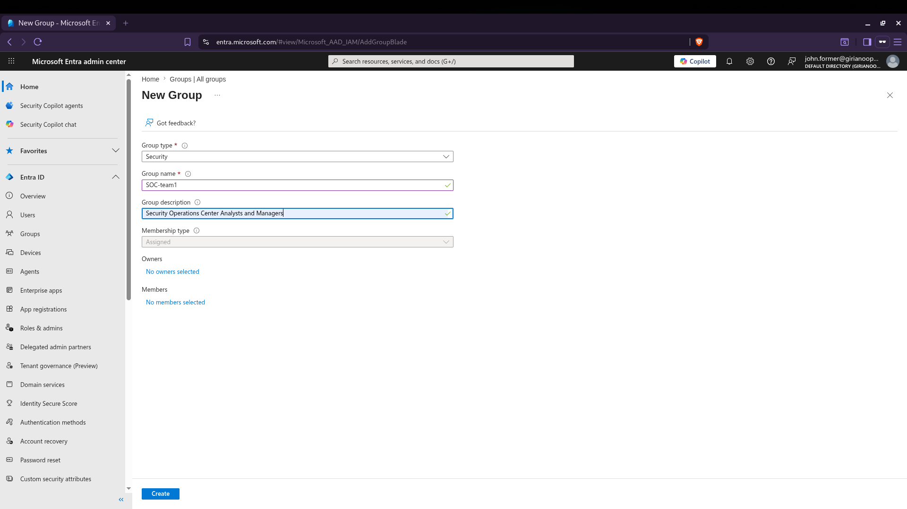
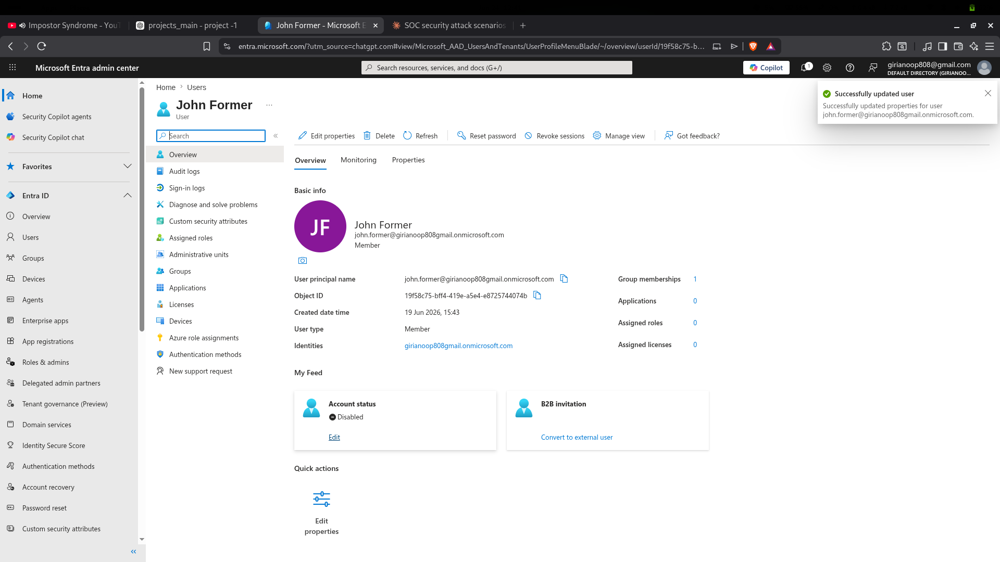
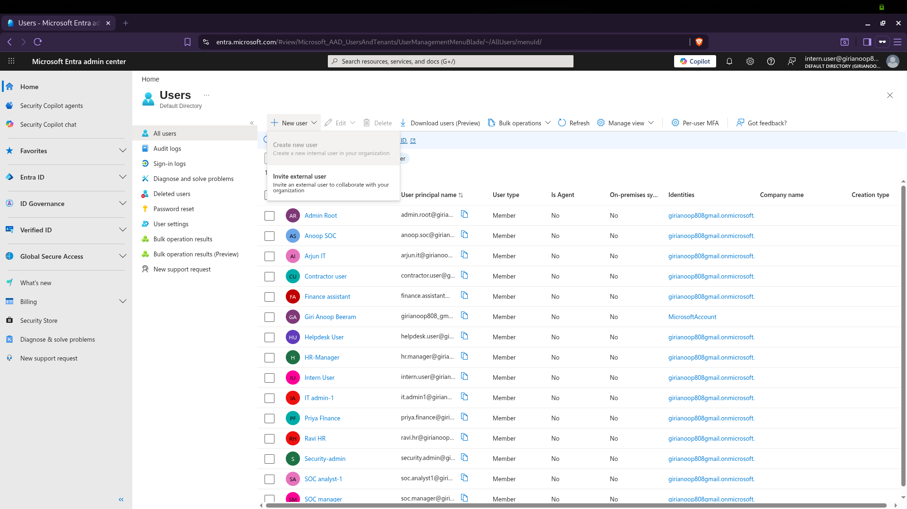
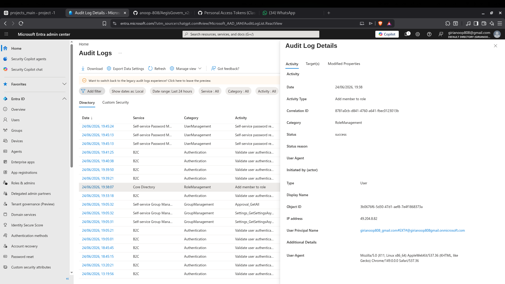

# AegisGovern_v2 - Cloud Identity Security & SOC Investigation Lab

## Overview

AegisGovern_v2 is a Microsoft Entra ID based identity security lab designed to simulate real-world identity attacks, privilege abuse scenarios, and SOC investigation workflows.

The project focuses on Identity and Access Management (IAM), privilege management, audit log analysis, attack detection, incident response, and security remediation within a cloud identity environment.

---

## Objectives

* Build a realistic Microsoft Entra ID lab environment
* Create users, groups, and administrative roles
* Simulate identity-based attack scenarios
* Investigate attacks using audit and sign-in logs
* Document findings using SOC-style incident reports
* Demonstrate identity security and governance concepts

---

## Environment

### Identity Platform

* Microsoft Entra ID

### Components

* Users
* Groups
* Administrative Roles
* Authentication Controls
* Audit Logs
* Sign-In Logs

---

## Attack Scenarios

---

## MITRE ATT&CK Mapping

| Attack Scenario | MITRE Technique | Technique ID |
|----------------|----------------|-------------|
| OAuth Consent Abuse | Steal Application Access Token | T1528 |
| Dormant Account Abuse | Valid Accounts: Cloud Accounts | T1078.004 |
| Excessive Permissions & Information Exposure | Account Discovery: Cloud Account | T1087.004 |
| Privilege Escalation via Role Assignment | Account Manipulation: Additional Cloud Roles | T1098.003 |

---

## Risk Severity Classification

| Attack Scenario | Severity |
|----------------|----------|
| OAuth Consent Abuse | High |
| Dormant Account Abuse | Medium |
| Excessive Permissions & Information Exposure | Medium |
| Privilege Escalation via Role Assignment | Critical |

---
### Attack 1 - OAuth Consent Abuse

**Affected User:** Priya Finance

**MITRE ATT&CK:** T1528 - Steal Application Access Token

Simulated a malicious OAuth application requesting delegated permissions through a fake rewards portal.

**Skills Demonstrated**

* OAuth Security
* Application Permission Review
* Audit Log Analysis
* Sign-In Log Investigation

**Evidence**

`evidence/attack1_oauth_consent`



---

### Attack 2 - Dormant Account Abuse

**Affected User:** John Former

**MITRE ATT&CK:** T1078.004 - Valid Accounts: Cloud Accounts

Simulated risks associated with inactive employee accounts remaining in the environment after departure.

**Skills Demonstrated**

* Identity Lifecycle Management
* Account Review
* Account Disablement
* Access Validation

**Evidence**

`evidence/attack2_dormant_account`



---

### Attack 3 - Excessive Permissions & Information Exposure

**Affected User:** Intern User

**MITRE ATT&CK:** T1087.004 - Account Discovery: Cloud Account

Demonstrated how a low-privileged account could enumerate users, groups, and directory information.

**Skills Demonstrated**

* Identity Reconnaissance
* Permission Analysis
* Directory Enumeration
* Access Review

**Evidence**

`evidence/attack3_excessive_permissions`



---

### Attack 4 - Privilege Escalation via Role Assignment

**Affected User:** Contractor User

**MITRE ATT&CK:** T1098.003 - Account Manipulation: Additional Cloud Roles

Simulated unauthorized assignment of the User Administrator role and investigated the resulting privilege escalation.

**Skills Demonstrated**

* Privileged Identity Management
* Role Assignment Analysis
* Audit Log Investigation
* Privilege Remediation

**Evidence**

`evidence/attack4_privilege_escalation`



---

## Investigation Reports

The project includes SOC-style incident reports for each attack scenario:

* incident_report_attack1.md
* incident_report_attack2.md
* incident_report_attack3.md
* incident_report_attack4.md

Location:

`reports/`

---

## Final Assessment

A consolidated security assessment report is available at:

`reports/AegisGovern_v2_Assessment_Report.md`

The report summarizes:

* Attack Scenarios
* Findings
* Risk Analysis
* Detection Activities
* Remediation Actions
* Security Recommendations

---

## Skills Demonstrated

### Identity Security

* Microsoft Entra ID
* Identity Governance
* Authentication Controls
* Administrative Role Management

### Security Operations

* Incident Investigation
* Audit Log Analysis
* Sign-In Log Analysis
* Security Documentation

### Governance, Risk & Compliance

* Access Reviews
* Least Privilege
* Identity Risk Assessment
* Security Recommendations

---

## Project Structure

```text
AegisGovern_v2
├── docs
├── evidence
│   ├── attack1_oauth_consent
│   ├── attack2_dormant_account
│   ├── attack3_excessive_permissions
│   └── attack4_privilege_escalation
├── reports
└── README.md
```

---

## Author

**B. Giri Anoop**

Cybersecurity Student | SOC Analyst Aspirant | Identity Security Enthusiast
